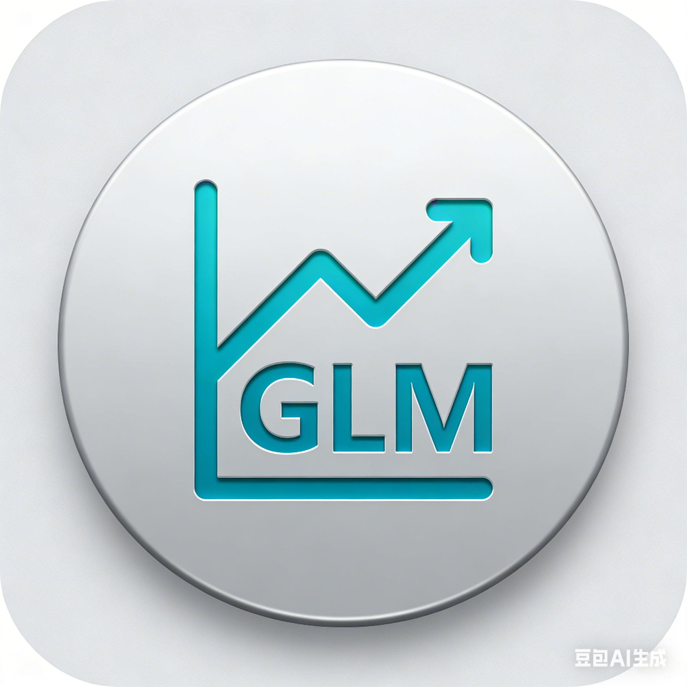

# GLM Usage

一个简洁的 macOS 菜单栏应用，用于监控 GLM Coding Plan 的用量信息。



## 功能特点

- **状态栏直接显示** - 周用量百分比直接显示在菜单栏，一目了然
- **详情面板** - 点击查看 5 小时额度、周额度、月额度详情
- **自动刷新** - 每 5 分钟自动更新数据
- **安全存储** - API Key 本地安全存储，不会上传

## 系统要求

- macOS 13.0+

## 安装使用

### 方式一：直接下载（推荐）

1. 前往 [Releases](../../releases) 下载最新版本的 `GLM_Usage.zip`
2. 解压后将 `GLM_Usage.app` 拖入 `/Applications` 目录
3. 首次运行可能需要在"系统设置 > 隐私与安全性"中允许

### 方式二：自行编译

```bash
# 克隆仓库
git clone https://github.com/BigKunLun/GLM-Usage.git
cd GLM-Usage

# 编译
swift build -c release

# 打包（或使用提供的脚本）
./build.sh
```

## 获取 API Key

1. 访问 [智谱开放平台](https://open.bigmodel.cn/)
2. 登录后进入控制台
3. 在 API Keys 页面获取您的 Key

## 使用说明

1. 首次启动点击"设置API Key"输入您的 API Key
2. 状态栏会显示当前周用量百分比，如 `GLM 23%`
3. 点击状态栏图标可查看详细用量信息
4. 点击齿轮图标可修改 API Key

## 状态栏图标说明

| 显示 | 含义 |
|------|------|
| `GLM 23%` | 周用量百分比（正常） |
| `GLM ⏳` | 正在加载数据 |
| `GLM ⚙️` | 未配置 API Key |
| `GLM ❌` | 请求出错 |

## 项目结构

```
GLM_Usage/
├── Sources/
│   ├── GLM_UsageApp.swift    # 应用入口
│   ├── ContentView.swift     # 主视图
│   ├── Models/               # 数据模型
│   ├── ViewModels/           # ViewModel
│   ├── Services/             # API 服务
│   └── Views/                # UI 组件
├── Package.swift             # Swift Package 配置
└── build.sh                  # 打包脚本
```

## 开发

```bash
# 构建
swift build

# 运行
swift run

# 发布版本构建
swift build -c release
```

## License

MIT License
